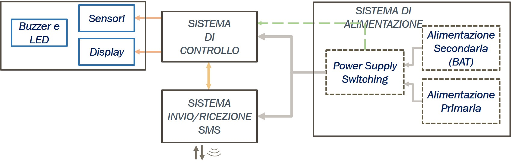
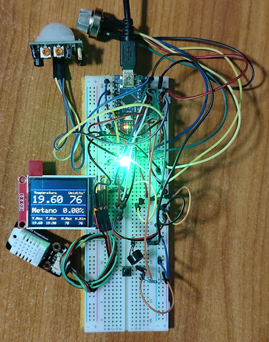
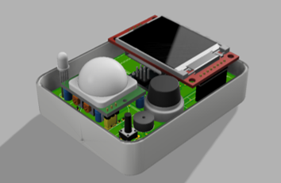
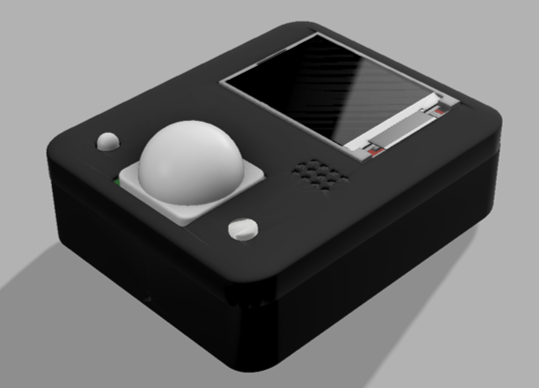

# *_Dispositivo per il monitoraggio indoor della qualità ambientale e inoltro dati tramite SMS_*
### Corso di Laurea Magistrale in Ingegneria Elettronica, Corso di Progettazione Industriale, Unical, aa 2020/2021
Il progetto prevede la realizzazione di un dispositivo smart adatto per contesti abitativi, uffici, ospedali, palestre, trasporti, scuole, per monitorare la qualità dell’aria interna e in generale dei parametri ambientali ad esso associata.
Il sistema è basato su diversi sensori e sistemi di notifica (visivo e uditivo, locale e in remoto). Altra funzionalità implementata è la notifica da remoto dello stato ambientale tramite SMS, riportando anche l’eventuale assenza di corrente nella rete elettrica domestica.
## Schema a blocchi del sistema

## Prototipo

## Render 3D del dispositivo

